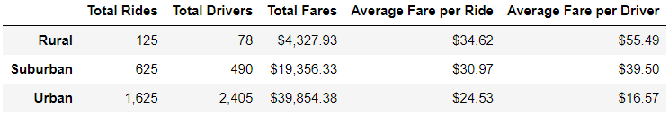
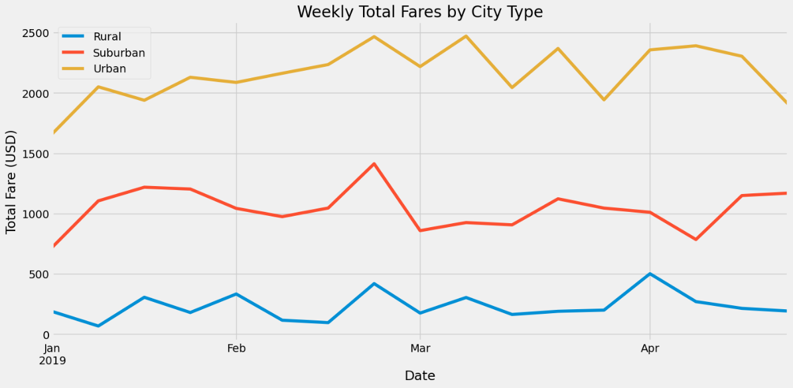
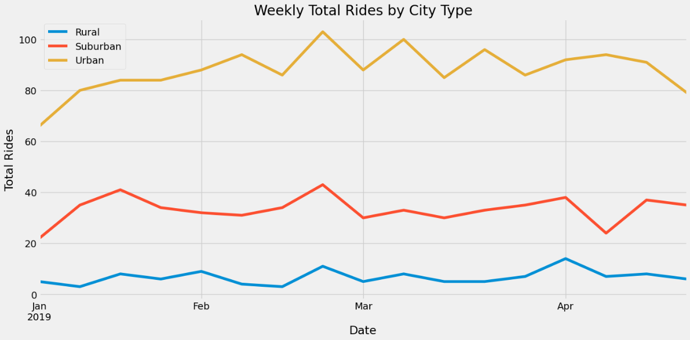
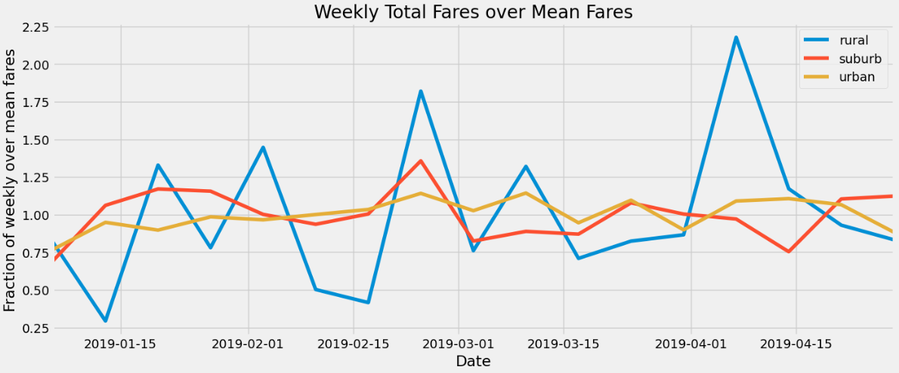

# Pyber Analysis

## Introduction  

Pyber is a ride-sharing company that operates in rural, suburban, and urban areas. To investgiate how the business can be improved across the three types of areas, we were given two datasets to analyze. The first dataset includes the name of a city Pyber operates in, the number of drivers in that city, and the type of area it is (rural, suburban, or urban). The second dataset is a collection of ride information, including the city the ride was in, time and date of the ride, cost of the ride, and a unique identifier of the ride. Our task is to combine these datasets and see what information we can gather.  

## Methods  

Since both datasets have a column of the city, we combined the two datasets into one dataframe. Since we want to compare the types of areas, lots of the analysis used the `groupby()` function on the type of area before doing arithmetic on the various values available.  

To get the number of rides in each area type, we count the number of unique ride identifiers after a groupby statement. Likewise, the total fare revenue is summed after a groupby statement. The number of drivers per area type is a bit more involved. Because each city includes the number of drivers, after the merge, each individual ride also includes the number of drivers in that city. So, a simple sum after a single groupby statement would over-count the number of drivers in an area type. To combat this, we first groupby the type of area *and* city, take a mean value (*x* * N / N is *x*) of those values so each city is only listed once, then groupby type on that result, and finally sum on the last groupby.  

Additionally, we can get average fares per ride and per driver by dividing the fare results above by the number of rides results and number of driver results above.  

Lastly, we group by date and area type to investigate fare totals for each area type per time interval. We resample the data to sum fare totals over week-long periods and plot the results. Additionally, we count the total number of rides per week.  

## Results  

Below is a summary table of Pyber rides per area type.  
  

From the table, there are more rides and drivers in urban areas over suburban areas over rural areas. Likewise, the total fares is greatest for urban areas and least for rural areas, leaving suburban areas between the two.  

Due to the greater number of total rides and total drivers, the average fares per ride and average fare per driver and least for the urban areas. Rural areas, accordingly, have the highest average fares per ride and per driver.  

The summed fares by week per type of area is shown below,  
  

The summed number of rides by week per type of area is show below,  
  

Lastly, the ratios of weekly fare totals over the mean fare total (over the entire duration) is plotted,  
  

## Discussion  

The population density of each area type is the explanatory variable for each of the results. The high density of the urban areas means rides are shorter, so the fare per ride is lower and also accounts for the increased number of rides. Conversely, the low density of the rural areas means individual rides are longer, increase the average fare per ride, but that there are also fewer of them. Indeed, the sheer number of rides for urban areas accounts for the total fares from urban areas compared to suburban and rural areas (though the same holds for suburban over rural areas).

What follows along with the population density is the number of drivers for each area, but this number is less useful to us. For example, the total number of drivers is just that: the total number, not the active number. To wit, the total number of rides over the total number of drivers gives us that there were ~0.68 rides per driver, a physical impossibility if each driver drove a ride. One recommendation for Pyber is to collect, or at least share, data for which driver gave each ride so better analyses can be made.  

From the first two graphs, we notice minor spikes of fare totals and ride totals compared to surrounding weeks. Because the fare totals spike as much as the ride totals do and there is no corresponding spike in the third graph, we deduce there is no surge pricing. Due to the increased demand during this periods, we recommend incorporating surge pricing to further increase revenue.  

From the third graph, we see that urban and suburban ride fares are fairly consistent week-to-week (the smooth decreases indicate more seasonal effects). The rural rides show a different story, though, of flip-flopping peaks and troughs in fare totals relative to the overall mean fare (this can be seen in the second graph as well, though it's obfuscated by the scale and low counts). One potential way to address this is to increase advertising in the rural areas so more people are familiar with, and likely to utilize, PyBer services.  

As well, coordinated efforts to start PyBer carpools in the suburban and rural areas could increase revenue by giving residents reason to go somewhere together. In these cases, the total fare per ride is increased without needing another driver (since there are already so few) or causing wear and tear on additional vehicles.
